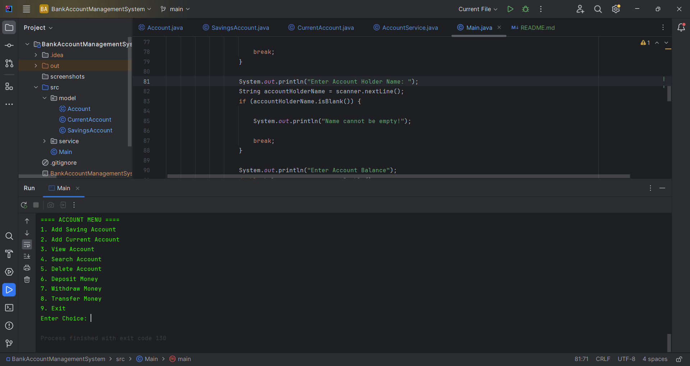
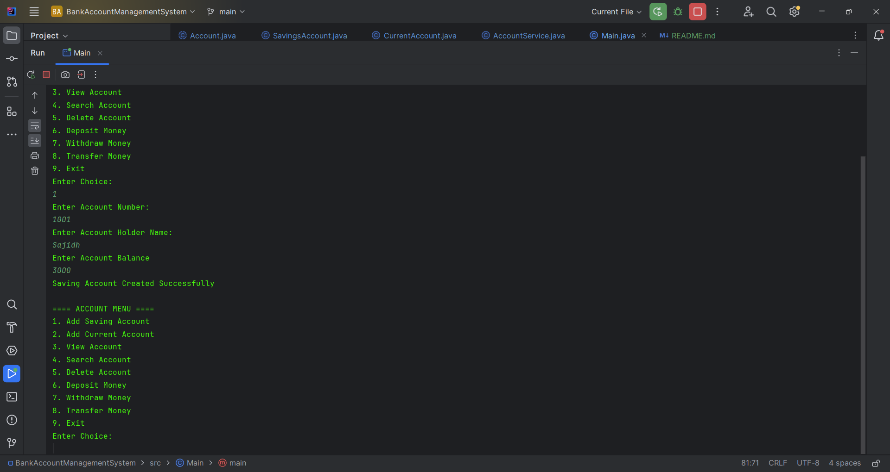
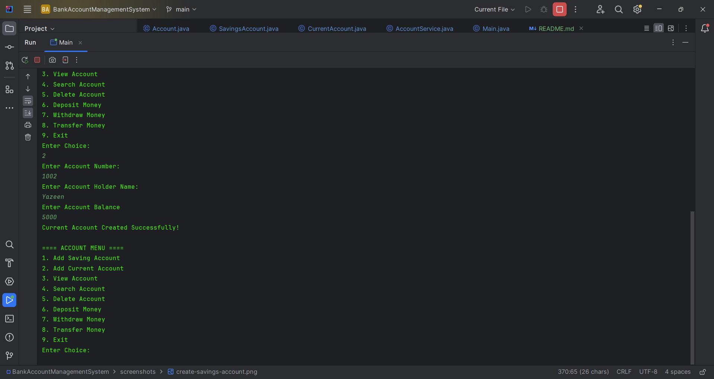
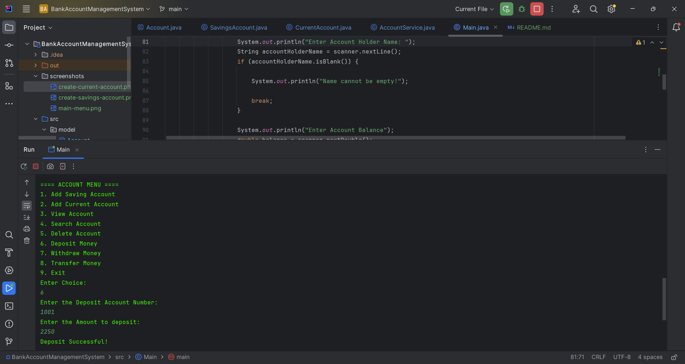
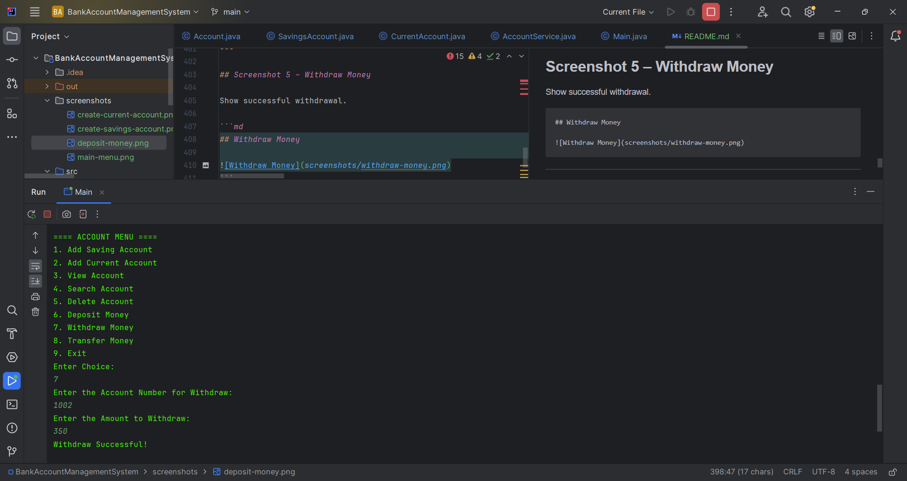
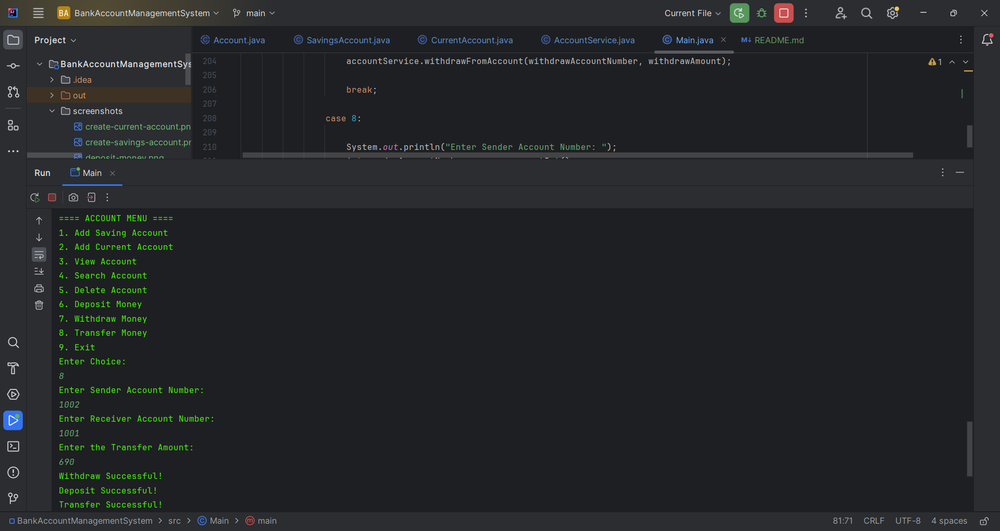
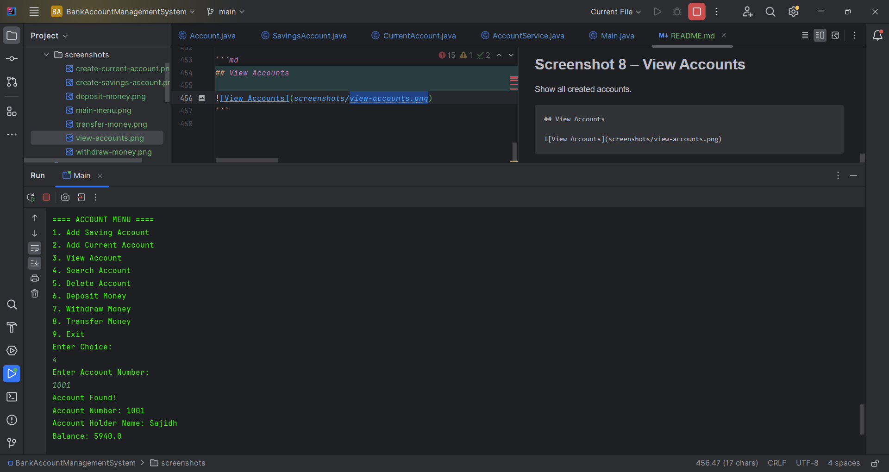
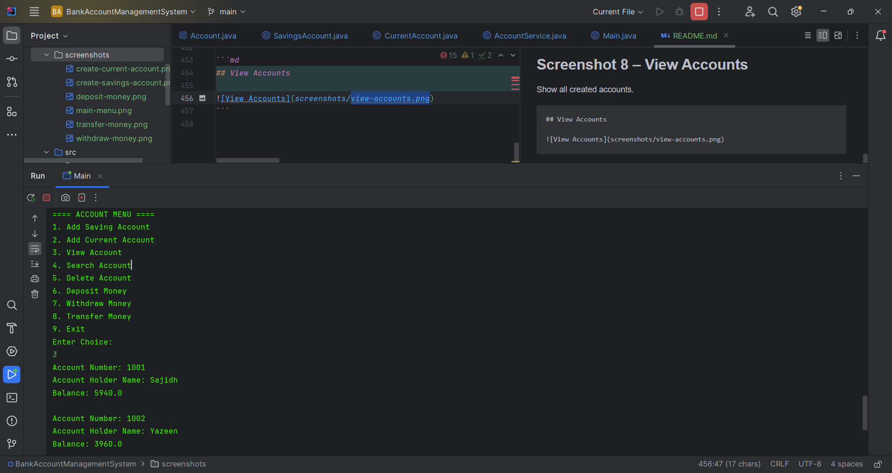

# Bank Account Management System (Java)

A console-based Bank Account Management System developed using Java and Object-Oriented Programming (OOP) principles. This project demonstrates core Java concepts including inheritance, abstraction, polymorphism, encapsulation, collections, exception handling, validation, and banking operations.

The system allows users to create and manage Savings and Current Accounts, perform deposits, withdrawals, transfers, and manage account records through a menu-driven interface.

---

## Features

### Account Management

* Create Savings Account
* Create Current Account
* View All Accounts
* Search Account by Account Number
* Delete Account

### Banking Operations

* Deposit Money
* Withdraw Money
* Transfer Money Between Accounts

### Validation & Security

* Duplicate Account Number Prevention
* Invalid Account Number Validation
* Empty Name Validation
* Positive Deposit Validation
* Positive Transfer Validation
* Same Account Transfer Prevention
* Account Existence Validation
* Overdraft Protection

### Exception Handling

* Invalid Menu Input Handling
* Non-Numeric Input Handling

---

## Technologies Used

* Java
* IntelliJ IDEA
* Git
* GitHub

---

## OOP Concepts Implemented

### Encapsulation

```java
private ArrayList<Account> accounts;
```

Data is protected and accessed through methods.

---

### Inheritance

```java
public class SavingsAccount extends Account
```

```java
public class CurrentAccount extends Account
```

Child classes inherit common account properties.

---

### Abstraction

```java
public abstract class Account
```

The Account class acts as a blueprint for all account types.

---

### Abstract Methods

```java
public abstract boolean withdraw(double amount);
```

Each account type provides its own withdrawal logic.

---

### Method Overriding

```java
@Override
public boolean withdraw(double amount)
```

Savings and Current accounts override withdrawal behavior.

---

### Polymorphism

```java
ArrayList<Account> accounts =
        new ArrayList<>();
```

The system stores multiple account types in a single collection.

Example:

```java
accounts.add(new SavingsAccount(...));
accounts.add(new CurrentAccount(...));
```

---

## Project Structure

```text
src
│
├── model
│   ├── Account.java
│   ├── SavingsAccount.java
│   └── CurrentAccount.java
│
├── service
│   └── AccountService.java
│
└── Main.java
```

---

## Account Types

### Savings Account

Rules:

* Balance cannot go below 0
* Withdrawal fails if insufficient funds exist

Example:

```text
Balance: 5000
Withdraw: 6000

Result:
Insufficient Balance!
```

---

### Current Account

Rules:

* Supports overdraft
* Minimum balance allowed: -5000

Example:

```text
Balance: 3000
Withdraw: 6000

Result:
Withdraw Successful!
Balance: -3000
```

---

## Banking Operations

### Deposit

```text
Enter Account Number
Enter Deposit Amount
```

Validation:

```text
Amount must be greater than 0
```

---

### Withdraw

```text
Enter Account Number
Enter Withdrawal Amount
```

Behavior depends on account type.

---

### Transfer

```text
Enter Source Account Number
Enter Destination Account Number
Enter Transfer Amount
```

Validation:

* Source account must exist
* Destination account must exist
* Source and destination cannot be the same account
* Transfer amount must be greater than 0
* Source account must have sufficient balance

---

## Sample Menu

```text
==== ACCOUNT MENU ====

1. Add Saving Account
2. Add Current Account
3. View Accounts
4. Search Account
5. Delete Account
6. Deposit Money
7. Withdraw Money
8. Transfer Money
9. Exit
```

---

## Learning Outcomes

This project helped reinforce:

* Java Fundamentals
* Object-Oriented Programming
* Inheritance
* Abstraction
* Polymorphism
* Method Overriding
* Collections Framework (ArrayList)
* Exception Handling
* Validation
* Business Logic Implementation
* Service Layer Architecture
* Menu-Driven Application Development

---

## Future Improvements

### File Persistence

Store account information in files so data remains after application restart.

### Database Integration

* MySQL
* PostgreSQL

### Authentication

* Admin Login
* Customer Login

### GUI Application

* JavaFX
* Swing

### Spring Boot Backend

Convert the application into a REST API.

### Unit Testing

Use JUnit for automated testing.

---

## Author

**Sajidh Yazeen**

BSc (Hons) Software Engineering

Aspiring Java Backend Developer

# Screenshot
















